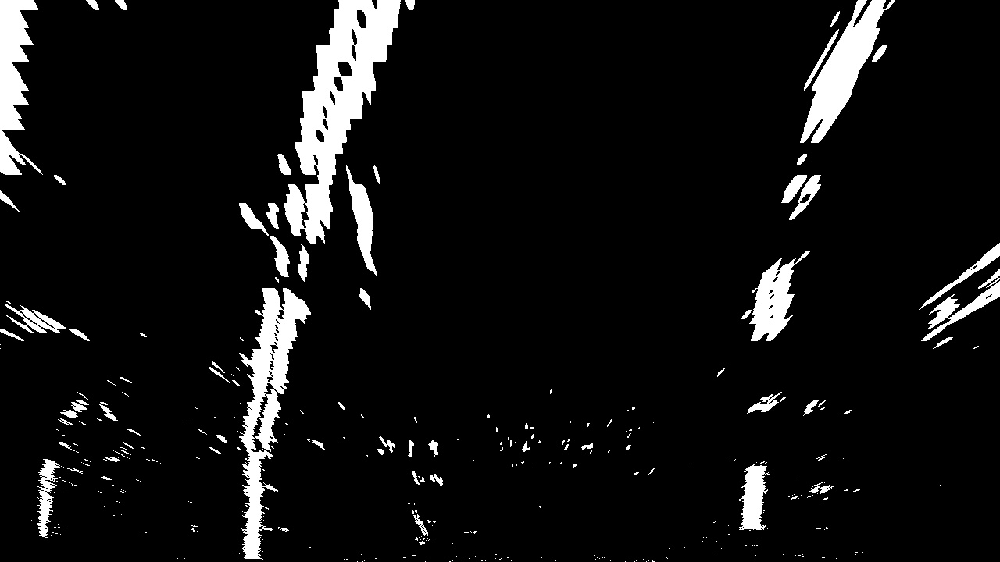

# **Title: Advance Lane Detection System**

## **1. Project Description**

This project is associated with Deep Learning and convolutional neural networks to create an
autonomous decision maker for vehicles which can do all the necessary calculations and
computations and processing such as being in right lane.

The following picture describes with what we are going to start

***

## **2. Methodology**

## Lane detection

The one of the most required activity in driving a car is to be in right lane to avoid any mis-
happening, thus one of the main concerns becomes to detect the lane so that the automated car
can run in a prescribed area and avoid accidents.

* `Camera calibration`: In the real world when a picture is captured in camera there comes distortion due to conversion of 3D plane in 2D plane. The algorithm where image is converted from 3d to 2d, suffers dilemma of winding at edges. Therefore, first step in detecting lanes become calibration of camera.

.png)
#### Finding Points on image

* `Perspective transform`: Since camera is recording from front, the lanes appear to
converge at far distance due to which curvature recognition becomes difficult. This happened because when an image is converted into 2d, the distance is demonstrated based on shape of object, i.e. more far an image, less is its size. Therefore there is needed to look it from some different perspective where they still appear parallel. The
best Perspective is to stare from top which is recognized as `bird eye view`.

* `Visualizing image in various Color space – COLOR THRESHOLDING`: Visualizing
image in different color spaces helps us to select the channel which best distinguish lane
lines, where Thresholding is important parameter for retrieving the information from
some sort of data such as important or required information of material from an image or
its background. Image is converted to various spaces like in rgb, hls, grayscale and
required minimum and maximum threshold for intensity is applied to create a mask and
`HLS works best for our case`

* `Combining Color and Gradient Thresholding`: The Binary pictures generated from these thresh hold are combined together to form one output.

####After applying color and gradient thresholding on warped image

* `Sliding window`: X position from drawing histogram gives starting position for applying
sliding window approach. This approach helps to find white points which are present
under the sliding window. The output of this step is points under sliding window which is
likely to be a part of lane line

## **5.Output & Screenshots** ## 
***
### Output Image showing Lane Detection by the system

> Simulation Video available in the Simulation Folder

